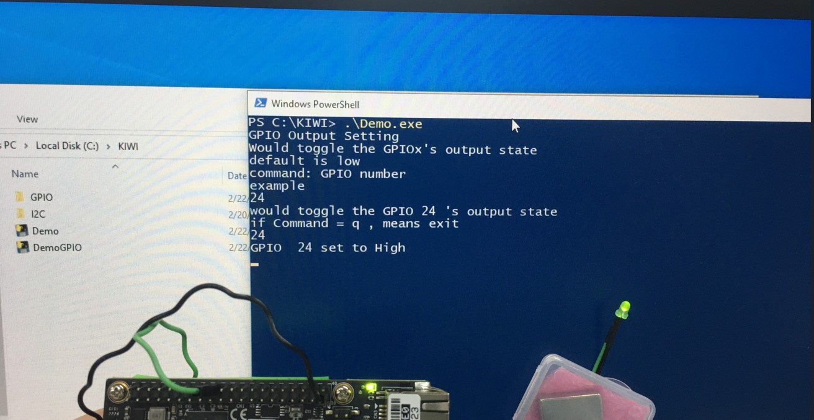

# Welcome to KiwiBoard Developer home

## How to Use :

+ For Tester


+ For Builder
  + Windows
```
#get Source code

   
#install required Toolchains  
    
    pip install pywinio

#Optional step
## a.Use PyInstaller for Packaging demonstration applications 

```


# Kiwi Framwork Introduction
As technology progresses, the CPU packaging is becoming more mature and smaller thanks to the evolution of chip technology. The market for IoT and Edge Computing is also expanding as a result of technological advancements.

Apart from existing industrial customers, various research institutions such as schools, enterprises, and workstations are investing a significant amount of budget in purchasing low-priced, miniaturized motherboards for experiments and projects. These experiments and projects allow students to try out innovative ideas and accumulate technical expertise, leading to collaboration with enterprises and publications.

KIWIboard offers a highly efficient, miniaturized motherboard that meets the market demand for IoT and Edge Computing and attracts the interest of schools and makers. It is also compatible with Raspberry Pi peripherals, allowing users to upgrade seamlessly. Furthermore, it supports three different operating systems, providing students and makers with unique experiences that inspire creative ideas and realization.

To help students and makers tackle technical issues encountered in software development, KIWIboard provides simple middleware sample code, allowing developers to get started and use the platform more quickly, significantly reducing development time.


# Software Architecture


# Hardware Architecture
>## Pin Define


>## Board Layout


# Implemeted Access function
PyKiwiUtility Support libraies to Interact with GPIO,I2C,SPI,PWM...

```python
  from PyKiwiUtility import PyKiwi
```

>## GPIO Access

|Function Name| Args |Returns| Usage | Example|
|--|--|--|--|--|
|SetGpioMode | GpioNum,Mode | 1 for Success , 0 for Otherwise | Set GpioNum to Input(1) or Output(0) | SetGpioMode(GpioNum,Mode)|
|SetGpioStatus | GpioNum,Level | 1 for Success , 0 for Otherwise | Set GpioNum's Level to Low(0) or High(1) | SetGpioStatus(GpioNum,Level)|
|GetGpioMode | GpioNum | \[isSuccess , isInput\] | Get GpioNum's Mode  | GetGpioMode(GpioNum)|
|GetGpioStatus | GpioNum | \[isSuccess , isHigh\] | Get GpioNum's Status  | GetGpioStatus(GpioNum)|

>## I2C Access

|Function Name| Args |Returns| Usage | Example|
|--|--|--|--|--|
|AccessI2c | SlaveAddress,Data,Size | \[isSuccess , ReadData\] | Send I2C protocol by Data and size, then return the data  | AccessI2c(self._I2C_ADDRESS, mWData,mRSize)|

# Demos
>## GPIO
### LED Light On

### LED Light Off

### Voltage Measurement


# Reference

[Kiwi_Middleware_V1.01.pdf](Documentaion/Kiwi_Middleware_V1.01.pdf)